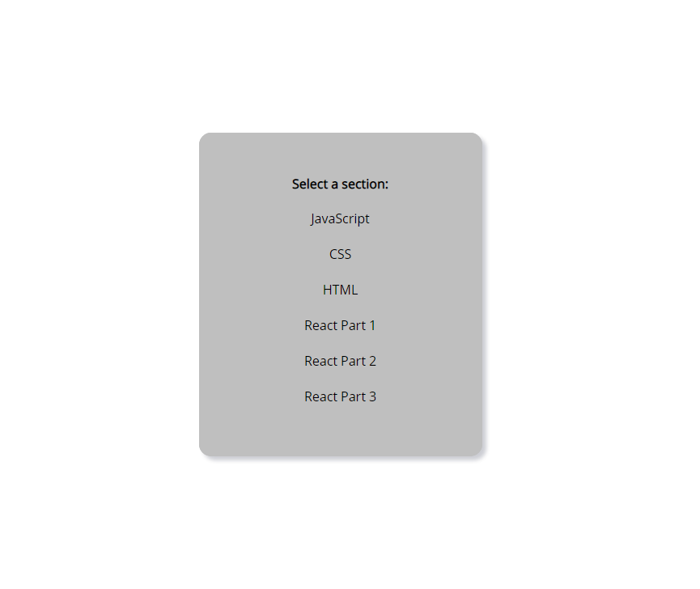
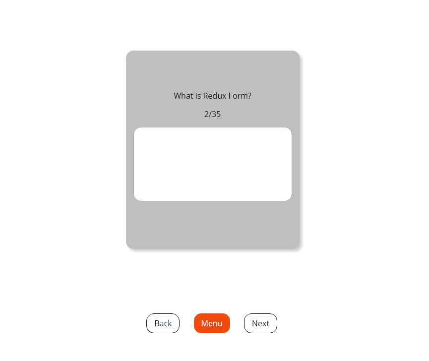
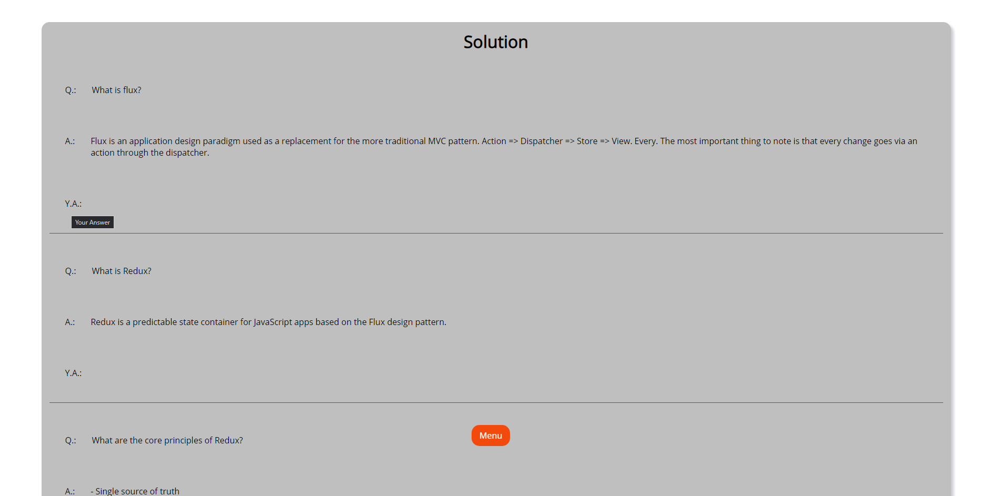

# 📄 Table of Contents

- [Introduction](#introduction)
- [Set up](#setup)
- [Ambition](#ambition)
- [Design](#design)

 
 
 

  

<h1 align="center">
 Test Your Knowledge
</h1>

An application for improving the knowledge about React

  
   
    

 

## 
 🛠 Set Up 

1. Install React ^16.13.1
2. Install React-Dom ^16.13.1
3. Install React-Redux ^7.2.0
4. Install Redux ^4.0.5
5. Install Redux-Logger ^3.0.6
6. Install React-ID-Generator ^3.0.0
7. Install React-Router-Dom ^5.1.2
8. Install Styled-Components ^5.0.1
9. Install Node-Sass ^4.13.1

 

## 
 🔥 Ambition 

"Practice makes perfect. After a long time of practicing, our work will become natrual, skillfull, swift, and steady. - Bruce Lee"

 

This Project is about diving deeper into React ecosystem!

